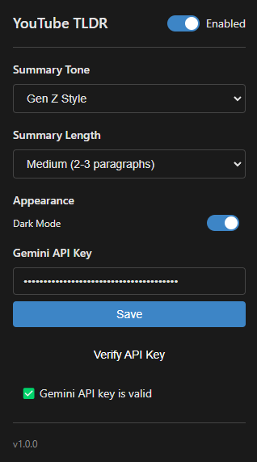
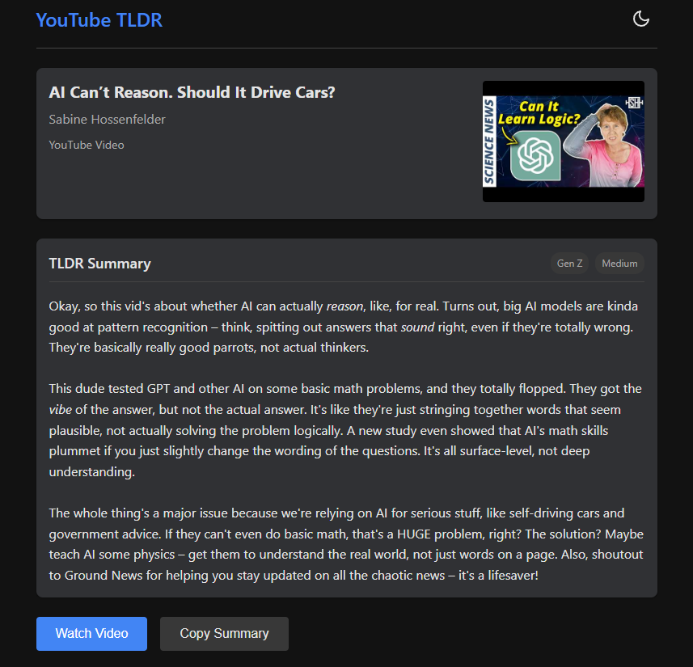

# YouTube TLDR Extension

A browser extension that intercepts YouTube video links and provides AI-generated summaries to help reduce distractions and make better decisions about your video consumption.




## Features

- Automatically intercepts YouTube video plays and redirects to a summary page
- Uses the YouTube API to fetch video transcripts
- Generates concise summaries using the Google Gemini API
- Customizable summary tones (Professional, Witty, Funny, Gen Z style, etc.)
- Adjustable summary lengths (Ultra-short to Detailed)
- Option to ask follow-up questions about the video content
- "Watch Video" button with confirmation to help maintain your focus intentions
- Dark mode support

## Installation

### Chrome Web Store (Coming Soon)

The extension will be available on the Chrome Web Store soon! Stay tuned for the link.

### Manual Installation

#### Prerequisites

- Google Gemini API key ([Get one here](https://makersuite.google.com/app/apikey))
   - Chill Out Its Free and enough for personal use case!
- Chrome, Edge, or other Chromium-based browser

#### Option 1: Install from GitHub Release

1. Go to the [Releases](https://github.com/Rtx09x/YouTube-TLDR/releases) page
2. Download the latest release ZIP file
3. Extract the ZIP file to a folder on your computer
4. Open your browser and navigate to the extensions page:
   - Chrome: `chrome://extensions/`
   - Edge: `edge://extensions/`
5. Enable "Developer mode" using the toggle switch
6. Click "Load unpacked" and select the folder where you extracted the files
7. The extension should now appear in your browser toolbar

#### Option 2: Clone the Repository

1. Clone this repository:
   ```
   git clone https://github.com/Rtx09x/YouTube-TLDR.git
   ```
2. Open your browser and navigate to the extensions page:
   - Chrome: `chrome://extensions/`
   - Edge: `edge://extensions/`
3. Enable "Developer mode" using the toggle switch
4. Click "Load unpacked" and select the cloned repository folder
5. The extension should now appear in your browser toolbar

### First Setup

1. Click the extension icon in your browser toolbar
2. Enter your Gemini API key in the settings
3. Configure your preferred summary tone and length
4. You're all set! The next time you click on a YouTube video, you'll see a summary instead

## Usage

- **Viewing Summaries**: Click any YouTube video link or thumbnail as usual - you'll be redirected to the summary page instead of the actual video
- **Changing Settings**: Click the extension icon to adjust preferences
- **Watching Videos**: If you decide to watch the video after reading the summary, click the "Watch Video" button at the bottom of the summary page
- **Ask Questions**: Use the chat interface on the summary page to ask specific questions about the video content
   - Let's be real here, the chat is really crappy right now and i'd love contributions but i'm not really free these days so... yeah!

## Customization

### Summary Tones

- Professional (default): Clear, straightforward language
- Witty: Humorous with clever observations
- Funny: Light-hearted and entertaining
- Gen Z: Casual with contemporary slang
- Academic: Formal and scholarly
- ELI5 (Explain Like I'm 5): Simple explanations for complex topics
- Sarcastic: Dry humor with irony

### Summary Lengths

- Ultra-short: 1-2 sentences with key points
- Short: 1 paragraph summary
- Medium (default): 2-3 paragraphs with main points
- Detailed: 4+ paragraphs with comprehensive coverage

## Privacy

This extension:
- Requires an API key that you provide and control
- Does not collect user data beyond what's needed to function
- Processes video content through the Gemini API using your own API key
- Does not send any data to our servers

## Contributing

Contributions are welcome! Here's how you can contribute:

1. Fork the repository
2. Create your feature branch: `git checkout -b feature/amazing-feature`
3. Commit your changes: `git commit -m 'Add some amazing feature'`
4. Push to the branch: `git push origin feature/amazing-feature`
5. Open a Pull Request

Please make sure to update tests as appropriate and follow the code style of the project.

## License

This project is licensed under the MIT License - see the [LICENSE](LICENSE) file for details. 
